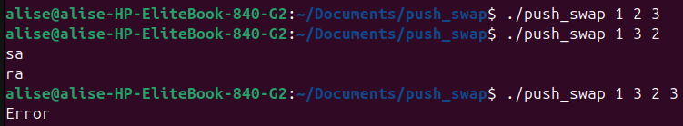
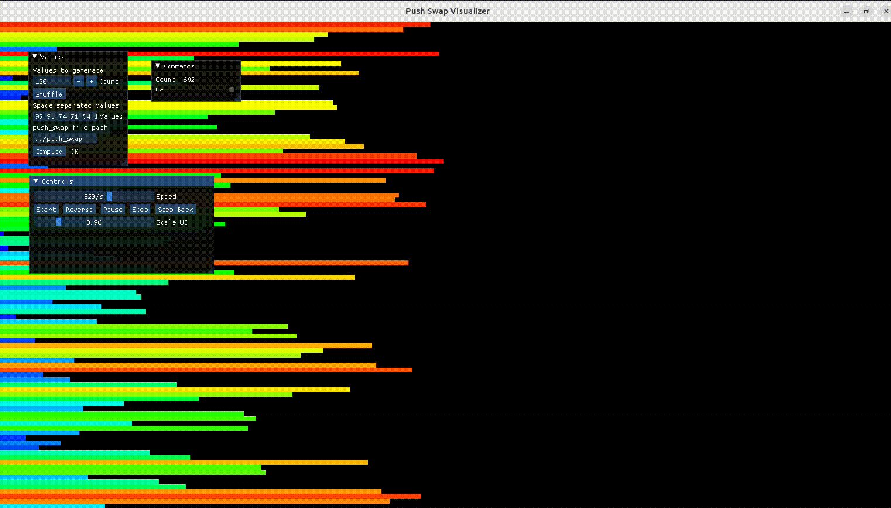

A C program that sorts integers using two stacks and a restricted instruction set while minimizing the total number of operations.

## Overview

`push_swap` is a 42 school algorithm project focused on optimization under constraints.  
The goal is to sort an unsorted list of integers by printing only allowed stack operations (`sa`, `pb`, `ra`, etc.), with as few moves as possible.

Why this project was built:
- Practice low-level data structure implementation in C.
- Build an efficient sorting strategy under strict operation constraints.
- Improve algorithmic thinking, cost modeling, and move optimization.

Project score:
- **100 / 100**
- Performance targets achieved:
- 100 numbers: under 700 operations
- 500 numbers: under 5500 operations

## Demo / Screenshots

### Example Input / Output



### Sorting Demo (GIF)



Example visualizer:
- https://github.com/o-reo/push_swap_visualizer

## Tech Stack

- **Language:** C
- **Build:** Makefile
- **Libraries:** Custom `libft`
- **Core Concepts:** Linked lists, stack operations, greedy cost-based move selection, input parsing and validation

## Architecture / Implementation

The project is organized around a linked-list stack model and a move-cost strategy.

Main design choices:
- Represent each stack as a singly linked list (`t_stack`) for efficient push/rotate operations.
- Annotate nodes with metadata (`pos`, `above_median`, `target`, `cost`) to support decision-making.
- For larger inputs, compute the cheapest node in stack B to move back to stack A based on combined rotation cost.
- Use specialized sort paths for small input sizes (`2`, `3`) and a scalable strategy for larger sets.

Important modules:
- `src/validation.c`: parsing, numeric checks, duplicate checks, sorted check
- `src/create_stack.c`: argument transformation and stack initialization
- `src/sort_moves.c`: primitive operations (swap, push, rotate, reverse rotate)
- `src/sorting.c`: sorting flow orchestration
- `src/sort_big_pos.c`: position and target-node calculations
- `src/sort_big_cost.c`: move-cost calculation and cheapest-node selection
- `src/sort_big_move.c`: coordinated rotations and node movement to target

## Features

- Robust input validation (format, integer limits, duplicates)
- Handles both quoted and split CLI argument styles
- Optimized operation output for constrained sorting
- Cost-based selection of best next move
- Separate strategies for small and large datasets
- Clean memory handling and project build structure

## Operations Reference

`push_swap` can only use a limited instruction set:

- `sa`: swap the first two elements of stack A
- `sb`: swap the first two elements of stack B
- `ss`: execute `sa` and `sb` simultaneously
- `pa`: push the top element from stack B to stack A
- `pb`: push the top element from stack A to stack B
- `ra`: rotate stack A upward (first element moves to the bottom)
- `rb`: rotate stack B upward (first element moves to the bottom)
- `rr`: execute `ra` and `rb` simultaneously
- `rra`: reverse rotate stack A (last element moves to the top)
- `rrb`: reverse rotate stack B (last element moves to the top)
- `rrr`: execute `rra` and `rrb` simultaneously

The core challenge is to sort correctly while minimizing the number of these operations.

## Input Format

`push_swap` accepts a list of integers from the command line and supports two input styles:

- Space-separated arguments:
- `./push_swap 3 2 1 6 5 4`
- Single quoted string:
- `./push_swap "3 2 1 6 5 4"`

Input rules:
- Values must be valid 32-bit signed integers (`INT_MIN` to `INT_MAX`)
- No duplicates are allowed
- Only numeric input is accepted (optional leading `+` or `-`)
- Invalid input prints `Error` to standard error

Behavior:
- If the input is already sorted, no operations are printed
- Otherwise, the program prints the optimized sequence of allowed operations, one per line

## Getting Started

### 1. Clone repository

```bash
git clone https://github.com/chilituna/push_swap.git
cd push_swap
```

### 2. Build

```bash
make
```

### 3. Run

```bash
./push_swap 2 1 3 6 5 8
./push_swap "3 2 1 6 5 4"
```

The program prints the sequence of operations needed to sort the input.

### 4. Clean build files

```bash
make clean
make fclean
make re
```

## Project Structure

```text
.
├── includes/
│   └── push_swap.h        # Types and function prototypes
├── src/
│   ├── main.c             # Entry point
│   ├── validation.c       # Input validation and safety checks
│   ├── create_stack.c     # Stack creation and initialization
│   ├── sort_moves.c       # Primitive stack operations
│   ├── sorting.c          # Sorting strategy orchestration
│   ├── sort_big_pos.c     # Position and target calculations
│   ├── sort_big_cost.c    # Cost model and cheapest-move selection
│   └── sort_big_move.c    # Executing optimized move sequences
├── Libft/                 # Personal C utility library
├── Makefile               # Build rules
└── README.md
```

## Future Improvements

- Add an automated benchmark script with move-count statistics
- Add optional checker integration workflow documentation
- Add CI for build and static analysis
- Document algorithm complexity and trade-offs in more depth
- Include visual examples for each major move strategy

## What I Learned

This project strengthened my ability to:
- Design and optimize algorithms under strict constraints
- Implement and debug linked-list based systems in C
- Build a cost model to guide greedy decision-making
- Write safer parsing/validation code for edge-case-heavy inputs
- Structure a medium-sized C project for readability and maintainability

## License

This project is licensed under the MIT License. See `LICENSE` for details.
